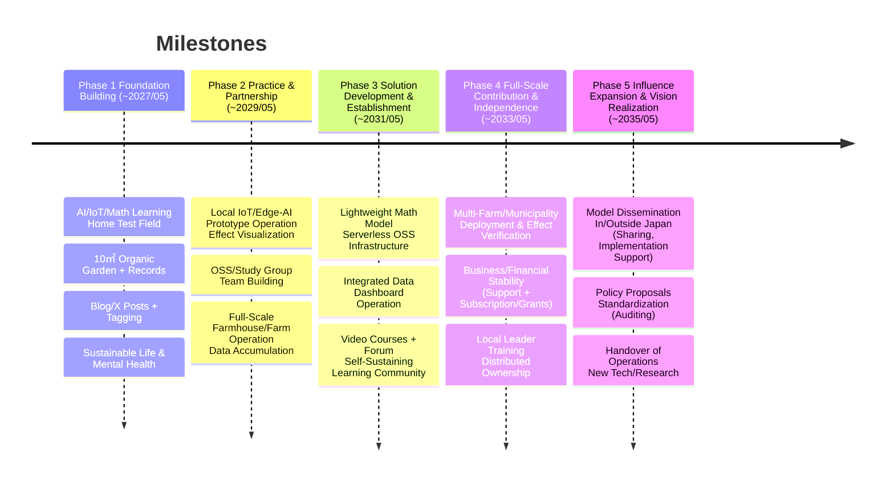

> **TL;DR**
> As I launch this blog, I realized the importance of clarifying my own vision first.
> Therefore, I have formulated a long-term vision for the next 10 years, looking ahead to 2035.
> This vision is a 10-year roadmap for solving the complex social issues faced by depopulated villages using mathematical models and advanced IT.

 

## Introduction

According to ChatGPT, the following steps are recommended for crafting a career vision:

> 1. **Self-analysis**: Understand your strengths, weaknesses, and interests.
> 2. **Build a long-term vision**: Imagine where you want to be in 5 or 10 years.
> 3. **Set milestones**: Clarify the skills and experiences needed to realize your vision and create concrete action plans.
> 4. **Feedback and adjustment**: Regularly review and adjust your vision as needed.

Following these steps, I have formulated my own vision.
The results of my self-analysis are described on the [About](/about) page.

 

## Vision Overview

### Ideal Goals

1. **Create innovative solutions**
   - Solve agricultural and community issues with IT and mathematical models, improving residents' QOL.
2. **Practice a sustainable lifestyle**
   - Build a self-sufficient living base by combining a renovated traditional house, home gardening, and renewable energy.
3. **Regional contribution and value co-creation**
   - Share knowledge through education, media, and open source, spreading impact to other regions.

 

## Vision Frameworks Used

I referenced the following frameworks in formulating my vision:

- [Ikigai](https://ikigaitribe.com/ikigai-framework/)
- [Future Self Visualization](https://athenawellness.com/blog/2024/2/15/envisioning-your-future-pt-3-future-self-visualization)
- [3 Layers Purpose](https://hbr.org/2022/03/what-is-the-purpose-of-your-purpose)

### Ikigai Analysis

- **What I Love**: Living in harmony with nature / Learning that satisfies curiosity
- **What the World Needs**: Sustainable rural models
- **What I Am Good At**: IT development, mathematical analysis, community design
- **What I Can Be Paid For**: System implementation, education, consulting

### Future Self Visualization

- **Core Values**

  - Living in harmony with nature (rural, quiet environment)
  - Sustainability and self-reliance (home garden, self-sufficiency)
  - Cooperation and contribution with family and community
  - Health and cleanliness
  - Continuous learning and technological innovation

- **Sources of Fulfillment**

  - Developing IT systems that solve local issues and are recognized
  - Building a self-sufficient, sustainable living base using IT
  - Shifting from freelance to regional contribution and being featured in media
  - Feeling social impact through education and community work

- **Skills in Use**

  - IT/software development (contract work, system design/implementation)
  - Mathematical modeling
  - Learning and practicing AI/IoT
  - Farm management (home garden, farm)
  - Education/community facilitation

- **Current Gaps**
  - Main work is contract development, not regional contribution
  - Farming is only occasional help, not self-managed
  - No concrete plan for renovating the family house
  - Limited community participation
  - Lack of knowledge and planning for self-sufficient living
  - Low awareness of cleanliness

### 3 Layers Purpose

| Layer          | Description                                           |
| -------------- | ----------------------------------------------------- |
| **Competence** | Solution development using IT and mathematical models |
| **Culture**    | Curiosity, continuous learning, embracing new tech    |
| **Cause**      | Realizing a sustainable rural society                 |

 

## Setting the Milestones

To build concrete milestones, I followed this sequence:

1. Conduct [scenario planning](https://www.indeed.com/career-advice/career-development/scenario-planning) to analyze future uncertainties
2. Survey each scenario and formulate core and optional strategies
3. Set concrete milestones based on the core strategies

### Scenario Planning

After listing possible external factors, I selected these two driving forces:

- **Trends in local economic growth/decline and employment environment**: Economic growth vs decline
- **Advancement of AI/data analytics and smart farming**: Tech stagnation vs progress

Combining these, I set four scenarios:

1.  **Economic growth & tech progress**: Capital inflow and network infrastructure bring smart farms to rural areas, revitalizing communities.
2.  **Economic growth & tech stagnation**: Local economies thrive, but agriculture remains experience-based due to tech lag.
3.  **Economic decline & tech progress**: Local economies shrink, but smart agri devices spread via national policy, though operators are lacking.
4.  **Economic decline & tech stagnation**: Both economy and tech stagnate, requiring DIY survival strategies with limited resources.

#### Core Strategy

| Area            | Key Measures                                                                                                                                                                                                                                                                                                                    |
| --------------- | ------------------------------------------------------------------------------------------------------------------------------------------------------------------------------------------------------------------------------------------------------------------------------------------------------------------------------- |
| **Skill Base**  | **Dual stack deepening** - Low-cost IoT + Edge AI - Serverless on GCP/Cloudflare **Math models x field knowledge** - Ongoing development/publication of lightweight models integrating weather, crop, economic data **Async facilitation** - Run small learning communities with video courses + forums |
| **Risk Mgmt**   | **Micro MVP loop** - 3-month "build → measure → continue?" cycles **Distributed community ownership** - Share results via OSS/CC licenses for sustainability **Mental & financial buffer** - Keep 20% of annual income as liquid assets - Daily HRV check + weekly self-review (fixed in calendar)      |
| **Opportunity** | **Open baseline principle** - Share trial data and tech notes on blog/X same day **Home garden = small test field** - Always accept university/municipal pilot projects **Consistent branding** - Tag all posts with "IT x Agriculture x Regional Issues" - Predefine negative comment response flow    |

#### Scenario-Specific Strategies

Scenario 1 — Economic Growth x Tech Progress

- OSS + project-based support: Publish common IoT stack, offer paid support only per project for companies
- Tech audit position: Provide neutral evaluation services for municipalities/VCs
- Industry standard guide: Draft compliance guidelines and establish a thought-leader brand

Scenario 2 — Economic Growth x Tech Stagnation

- Retrofit experience kits: Lend existing devices + ESP32, provide online video guides
- Outsource tourism x education: NPOs operate, you supervise tech
- Crowdfunding story design: Set quantitative goals to win support from conservative backers

Scenario 3 — Economic Decline x Tech Progress

- Remote AI operation: Offer field monitoring/fertilization as monthly + performance-based service
- Joint research on extreme weather data: Co-author papers/patents with national universities
- National project proposals: Submit microgrid + field IoT packages for food security/decarbonization (prepare application templates in advance)

Scenario 4 — Economic Decline x Tech Stagnation

- DIY LoRa mesh: Build low-maintenance network with used sensors & off-grid power
- Appropriate tech library: OSS lightweight math models and traditional knowledge, become a key figure
- Micro-payments + grants: Monthly summary posts for Patreon/domestic & international OSS grants (set up co-admins)

### Building the Key Milestones

I divided the roadmap into five phases and set the main milestones as follows.

#### Phase 1: Foundation Building (~ May 2027)

- **Establish knowledge & experiment base**: Systematic learning of AI/IoT/math models + home as a small test field
- **Small-scale farming practice**: Try organic cultivation in a 10㎡+ home garden, record work and yields
- **Start information sharing & self-branding**: Aggregate exploration logs on blog/X, tag with "IT x Agriculture x Regional Issues"
- **Sustainable life & mental setup**: Set up minimal living flow and stress monitoring

#### Phase 2: Practice & Partnership (~ May 2029)

- **Local small-scale proof success**: First IoT/Edge-AI prototype operates in Aoya, effects visualized
- **Build trust with community**: Form small, deep-collaboration teams via OSS/study groups
- **Full-scale farmhouse & farm operation**: Partially operate self-sufficiency model, accumulate data

#### Phase 3: Solution Development & Establishment (~ May 2031)

- **Establish scalable common stack**: OSS lightweight math model + serverless base (Aoya Model v1)
- **Standardize data-driven decision-making**: Operate dashboard integrating agri/weather/economic data
- **Establish education & talent programs**: Run self-sustaining async learning community with video courses + forum

#### Phase 4: Full-Scale Contribution & Independence (~ May 2033)

- **Deploy to multiple farms/municipalities**: Reproduce productivity/cost reduction effects, prove regional impact
- **Business & financial stabilization**: Achieve annual cashflow surplus via support, subscription, grants
- **Expand community facilitation**: Train local leaders, realize distributed ownership

#### Phase 5: Influence Expansion & Vision Realization (~ May 2035)

- **Disseminate "Aoya Model" in/outside Japan**: Share cases via papers, conferences, media, support other regions
- **Policy proposals & standardization**: Draft guidelines, serve as lead auditor for public projects
- **Succession & deepening self-exploration**: Handover operations to successors, return to new tech/research

 

## Conclusion

By formulating this vision, I have gained a clear direction for my career and lifestyle.
To realize this vision, I will use planners and calendars to stay aware of my goals and move tasks forward daily.

## Final Thoughts

I used OpenAI O3 extensively in formulating this vision.
O3's strong agent-like capabilities—researching information automatically while answering—make it feel very practical.

I'm excited to see more agentic AIs like this emerge in 2025.
