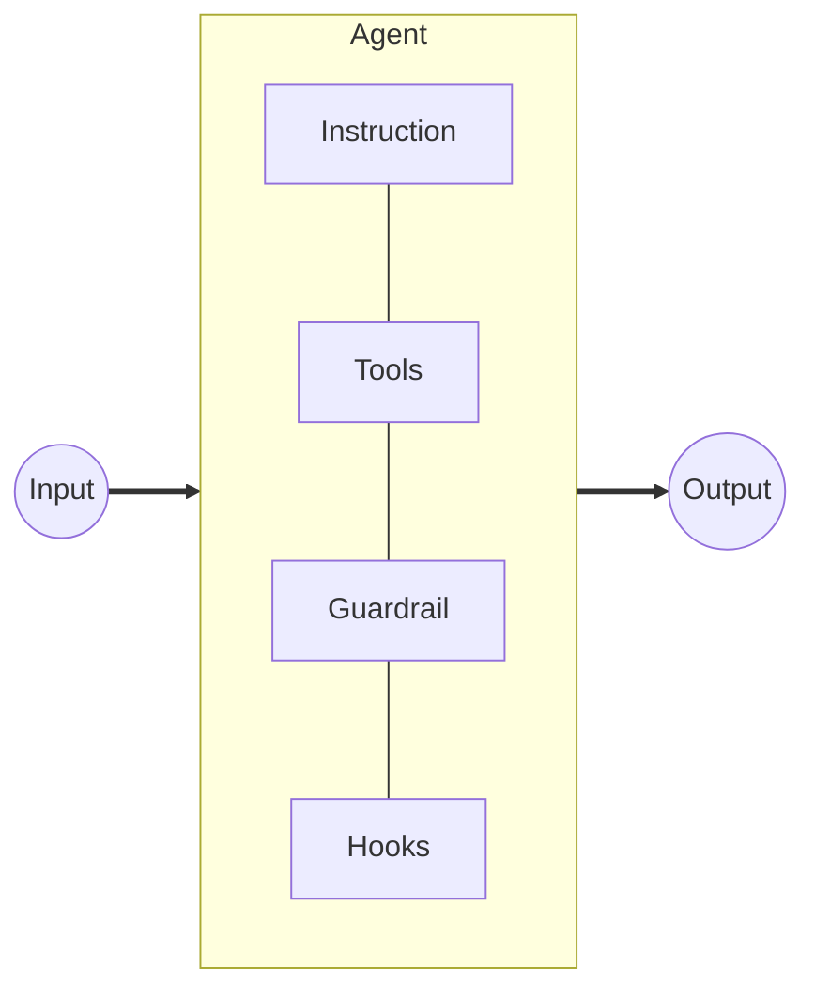
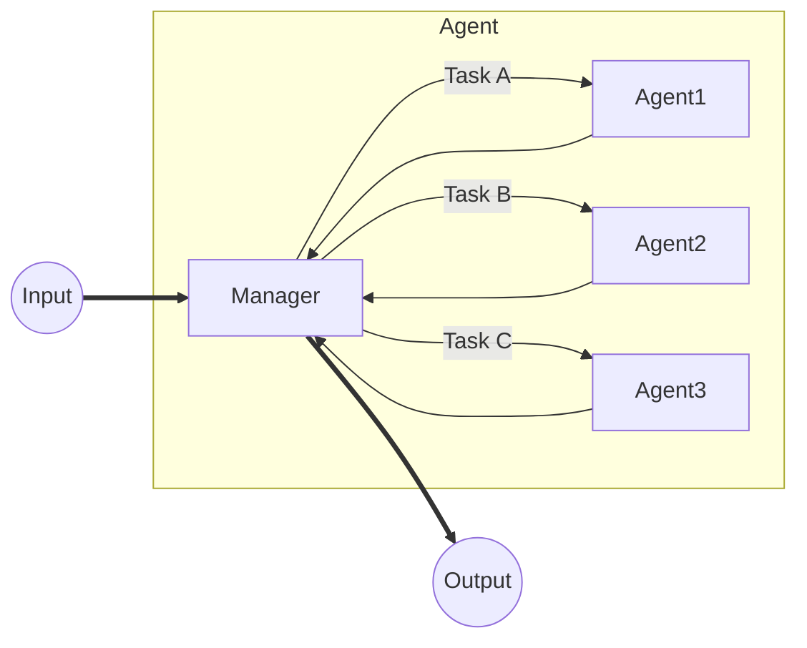
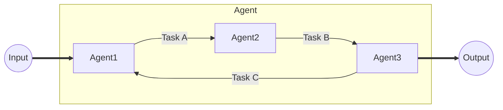

> **TL;DR**
> As AI agent-related projects are likely to increase in my work, I summarized the current configuration and practices for agents based on OpenAI's official agent guide.
>
> - [A practical guide to building agents - OpenAI](https://cdn.openai.com/business-guides-and-resources/a-practical-guide-to-building-agents.pdf)

 

## What is an Agent?

While there are several patterns depending on the company, OpenAI defines them as follows:

> Agents are systems that independently accomplish tasks on your behalf.

In other words, an agent is a **system that autonomously executes tasks independently of the user**. This definition does not include systems where the LLM does not make judgments or decisions to execute actions. For example, systems like RAG 
or those that execute actions according to predefined fixed rules are not called agents here. However, systems like Deep Research, where the LLM autonomously plans, searches, acts, and uses the results as feedback for further actions, are considered agents.

Specifically, the following cases are introduced as application areas for agents:

- **Complex decision-making**: When it's necessary to make decisions that depend on subtle judgments, exceptions, or ambiguous contexts.
- **Workflows with difficult-to-maintain rules**: When processes proceed according to somewhat fixed rules, but system maintenance and management are difficult due to cost or complexity.
- **Reliance on unstructured data**: When it's necessary to extract meaning from unstructured data or interact with usersconversationally.

 

## Agent Design

### Core Components

An agent consists of the following three components:

1. **Models**
2. **Tools**
3. **Instructions**

#### Models

OpenAI's best practice suggests that it is effective to **start with the most powerful model and adjust to smaller models as needed**. This is because starting with a smaller model can limit the agent's capabilities and make task achievement difficult.

#### Tools

Tools define the actions an agent can perform and are classified into the following three types:

- **Data**: Retrieves contextual information from DBs, files, or websites.
- **Action**: Executes actions such as adding or updating records in a DB or sending messages.
- **Orchestration**: Functions as a tool for other agents.

#### Instructions

Instructions define the agent's behavior, and the following are best practices:

- **Use existing documents, templates, and manuals** to define the agent's behavior.
- **Define clear and easily communicable actions**.
- **Capture edge cases and exceptions**.

### Agent Orchestration

Generally, agent implementation is divided into two approaches: **Single-Agent Systems** and **Multi-Agent Systems**.

#### Single-Agent Systems

A single-agent system is the simplest type of agent, where a single agent executes tasks. It consists of the following components:

Guidelines for transitioning to multi-agent systems include the following:

- When **tasks have complex logic**.
- When an **agent has too many tools** (e.g., 10-20 or more tools).

#### Multi-Agent Systems

Two successful approaches are introduced here.

##### Centralized (Manager)

The manager approach involves a central agent that coordinates the work of other agents. Notably, all input is received and output is generated through the manager.

##### Decentralized

Agents operate independently and communicate with each other. In particular, agents can assign tasks to other agents and provide feedback on results.

 

## Setting Up Guardrails

Guardrails define rules and constraints to control an agent's behavior. This prevents the agent from performing inappropriate actions or causing unintended consequences.

The following are major guardrails:

- **Relevance Classifier**: Flags off-topic or irrelevant input queries to ensure responses stay on topic.
- **Safety Classifier**: Detects and filters harmful or unsafe content such as jailbreaks and prompt injections.
- **PII Filter**: Detects and filters personally identifiable information (PII) to protect user privacy.
- **Moderation**: Detects and filters harmful or inappropriate content such as hate speech, harassment, and violence.
- **Tool Safeguards**: Evaluates the safety and reliability of tools used by the agent.
- **Rule-based Guardrails**: Simple rules such as blocklists, input length restrictions, and regular expression filters.
- **Output Validation**: Validates the agent's output to prevent harm to users or the brand.

 

## Summary and Impressions

An agent is a system that autonomously executes tasks independently of the user and is applied in cases involving complex decision-making, workflows with difficult-to-maintain rules, or reliance on unstructured data. Agents consist of three core components: models, tools, and instructions, and there are two approaches: single-agent systems and multi-agent systems. Guardrails define rules and constraints to control agent behavior and play a role in preventing inappropriate actions.

I had a general understanding of agent implementation, but learning about specific best practices and the installation of guardrails was very informative. If I have the time and opportunity, I would like to try implementing an agent myself.
