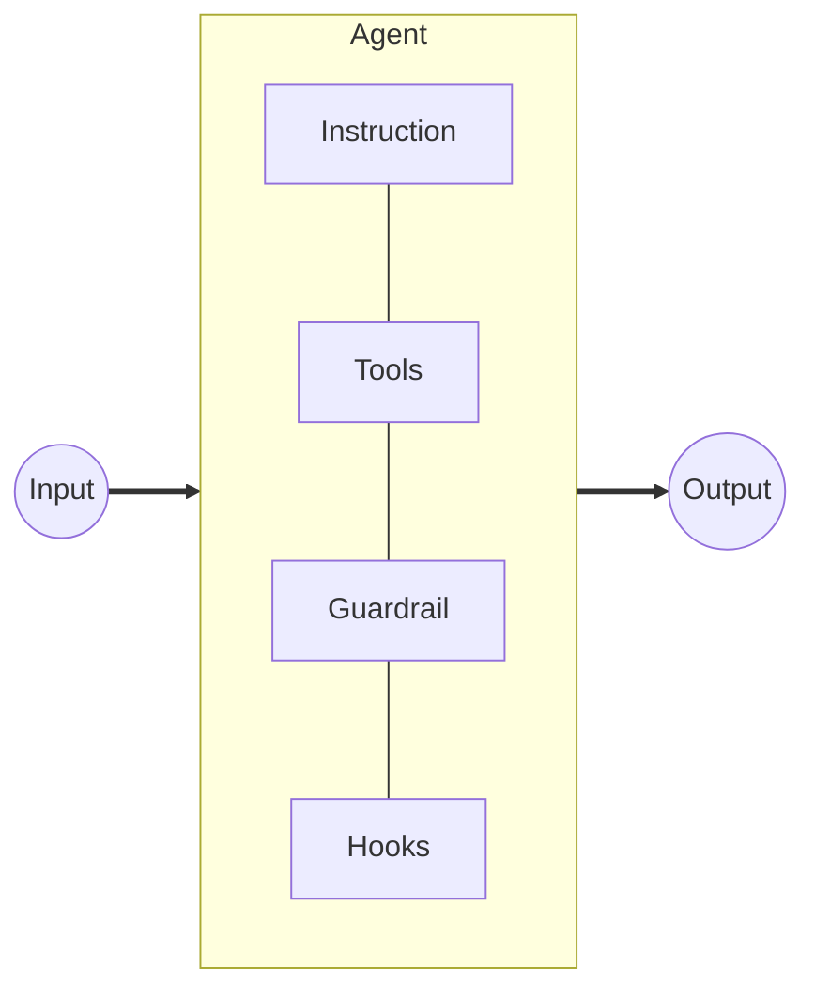
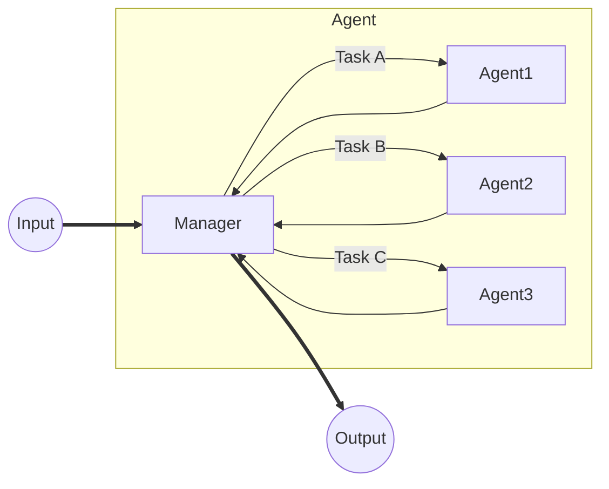
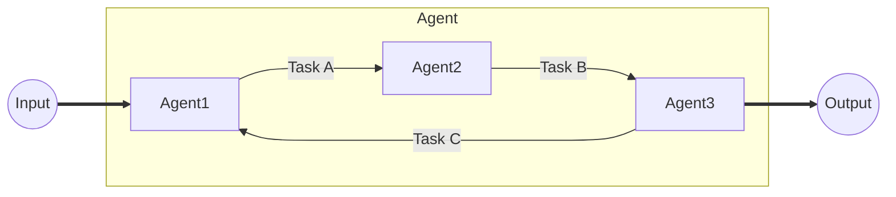

今回は以下の OpenAI 公式のエージェントガイドを参考に、現時点におけるエージェントの構成やプラクティスについてまとめてみた。

- [A practical guide to building agents - OpenAI](https://cdn.openai.com/business-guides-and-resources/a-practical-guide-to-building-agents.pdf)

## エージェントとは

企業毎にいくつかのパターンがあるが、OpenAI では以下のように定義されている。

> Agents are systems that independently accomplish tasks on your behalf.

つまり、エージェントは**ユーザーから独立して自立的にタスクを実行するシステム**である。この定義には、LLM が判断や意思決定を行ってアクションを実行する仕組みが組み込まれていないようなシステムは含まれない。例えば、RAG や予め決まった固定のルールに従ってアクションを実行するシステムは、ここではエージェントとは呼ばないが、Deep Research のように LLM が自立的に計画を立てて検索・アクションを行い、その結果をフィードバックしてさらなるアクションを行うようなシステムはエージェントとみなされる。

特に、エージェントの適用範囲として、以下のようなケースが紹介されている。

- **複雑な意思決定**: 微妙な判断、例外、曖昧なコンテキストに依存する意思決定を行う必要がある場合
- **維持が難しいルール**のワークフロー: ある程度決まったルールで進行するが、コストや複雑さのためにシステムの維持や管理が難しい場合
- **非構造化データに依存**: 非構造化データから意味を抽出したり、会話形式でユーザーとやり取りする必要がある場合

## エージェントの設計

### コアコンポーネント

エージェントは次の 3 つのコンポーネントから構成される。

1. **モデル (Models)**
2. **ツール (Tools)**
3. **指示 (Instructions)**

#### モデル (Models)

OpenAI によるベストプラクティスでは、**最初は最も強力なモデルを使用し、必要に応じて小さなモデルに調整していく**ことが効果的であるとされている。これは、最初から小さなモデルを使用すると、エージェントの能力が制限され、タスクの達成が難しくなる可能性があるためである。

#### ツール (Tools)

ツールはエージェントが実行できるアクションを定義するもので、以下の 3 つのタイプに分類される。

- **データ (Data)**: DB、ファイル、ウェブサイトからコンテキスト情報を取得する
- **アクション (Action)**: DB にレコードを追加または更新したり、メッセージを送信するなどのアクションを実行する
- **オーケストレーション (Orchestration)**: 他のエージェントのツールとして機能する

#### 指示 (Instructions)

指示はエージェントの振る舞いを定義するもので、以下のようなベストプラクティスがある。

- **既存のドキュメント、テンプレート、マニュアルを使用**してエージェントの振る舞いを定義する
- **明確で伝わりやすいアクション**を定義する
- **エッジケースや例外をキャプチャ**しておく

### エージェントのオーケストレーション

一般的に、エージェントの実装は、**シングルエージェントシステム (Single-Agent Systems)**と**マルチエージェントシステム (Multi-Agent Systems)**の 2 つのアプローチに分けられる。

#### シングルエージェントシステム (Single-Agent Systems)

シングルエージェントシステムは、最もシンプルなエージェントであり、単一のエージェントがタスクを実行するシステムである。以下のような構成要素から成り立っている。

マルチエージェント化するガイドラインとしては以下のようなものが紹介されている。

- **タスクが複雑なロジックを持つ**場合
- **エージェントがツールを多く持ちすぎている**場合 (例: 10-20 個以上のツール)

#### マルチエージェントシステム (Multi-Agent Systems)

ここでは、2 パターンの成功したアプローチが紹介されている。

##### 中央集権型 (Manager)

マネージャーは、他のエージェントの作業を調整する中央エージェントを配置するアプローチである。特に、入力を受け取るのもアウトプットを生成するのも全てマネージャーを経由する。

##### 分散型 (Decentralized)

エージェントは独立して動作し、互いに通信するアプローチである。特に、エージェントは、他のエージェントにタスクを割り当てたり、結果をフィードバックしたりすることができる。

## ガードレール(Guardrails)の設置

ガードレールは、エージェントの振る舞いを制御するためのルールや制約を定義するものである。これにより、エージェントが不適切なアクションを実行したり、意図しない結果を引き起こすことを防ぐことができる。

以下のような主要なガードレールがある。

- **関連性分類器 (Relevance Classifier)**: トピックから外れたり無関係な入力クエリにフラグを立て、応答がトピックにとどまるようにする
- **安全性分類器 (Safety Classifier)**: ジェイルブレイクやプロンプトインジェクションなどの有害または安全でないコンテンツを検出してフィルタリングする
- **PII フィルター (PII Filter)**: ユーザーのプライバシーを保護するために、個人を特定できる情報 (PII) を検出してフィルタリングする
- **モデレーション (Moderation)**: ヘイトスピーチ、ハラスメント、暴力などの有害または不適切なコンテンツを検出してフィルタリングする
- **ツールセーフガード (Tool Safeguards)**: エージェントが使用するツールの安全性と信頼性を評価する
- **ルールベースのガードレール (Rule-based Guardrails)**: ブロックリスト、入力長の制限、正規表現フィルターなどの単純なルール
- **出力検証 (Output Validation)**: ユーザーやブランドに害を及ぼすのを防ぐために、エージェントの出力を検証する

## まとめと所感

エージェントは、ユーザーから独立して自立的にタスクを実行するシステムであり、複雑な意思決定や維持が難しいルールのワークフロー、非構造化データに依存する場合に適用される。エージェントは、モデル、ツール、指示の 3 つのコアコンポーネントから構成され、シングルエージェントシステムとマルチエージェントシステムの 2 つのアプローチがある。ガードレールは、エージェントの振る舞いを制御するためのルールや制約を定義し、不適切なアクションを防ぐ役割を果たす。

エージェントの実装に関してはふんわりとは理解していたが、具体的なベストプラクティスやガードレールの設置に関して知ることができたのでとても有意義だった。時間や機会があれば、実際にエージェントを実装してみたいと思う。
